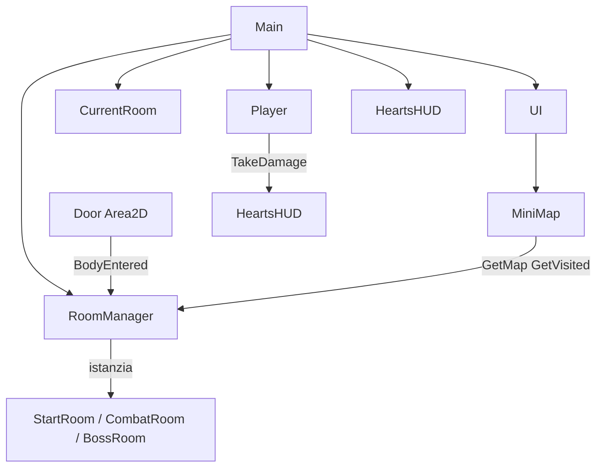

# Capitolo 4 — Implementazione

In questo capitolo viene descritto **come è stato realizzato** il prototipo di gioco *Flesh & Steel* nello stato attuale dello sviluppo. Il risultato ottenuto non coincide necessariamente con ogni dettaglio della progettazione iniziale: ad esempio, le texture di stanza vengono assegnate a runtime in base alla posizione nella griglia, e la morte del giocatore provvisoriamente ripristina i punti vita in attesa di un vero stato di game over.

Il lavoro è organizzato in modo che un lettore possa ricostruire il flusso logico principale: generazione del dungeon, caricamento stanze, combattimento e sblocco porte, transizioni, salute, doppia forma del protagonista e minimappa. Per passaggi particolarmente critici sono riportati estratti di codice sorgente; per elementi visivi si indicano punti in cui inserire screenshot dall’editor Godot o dal gioco in esecuzione.

> **Nota:** il capitolo verrà aggiornato al completamento del progetto (boss fight definitivo, game over, audio, bilanciamento, ecc.). Per aggiornamenti incrementali si rimanda ai diari di sviluppo.

---

## 4.1 Contesto tecnologico e architettura

Il gioco è sviluppato con **Godot Engine 4** e linguaggio **C#**. Le scene sono file `.tscn`; la logica di gioco risiede in script C# collegati ai nodi.

La scena principale è `Scenes/Main.tscn`, con la seguente organizzazione logica:

| Nodo | Ruolo |
|------|--------|
| `Player` | Movimento, combattimento, salute, trasformazione Flesh/Steel |
| `RoomManager` | Griglia 3×3, caricamento stanze, spawn nemici, porte |
| `CurrentRoom` | Contenitore della stanza istanziata dinamicamente |
| `UI/MiniMap` | Minimappa 3×3 (solo icone generiche) |
| `HeartsHUD` | Presentazione visiva dei punti vita |



**Scelta implementativa:** centralizzare lo stato del dungeon in `RoomManager` anziché distribuirlo su script per ogni stanza. In questo modo minimappa, porte, texture di sfondo e spawn nemici restano coerenti con un’unica fonte di verità (`map`, `visited`, `cleared`, coordinate correnti).

---

## 4.2 Generazione procedurale del dungeon

**File:** `Scripts/RoomManager.cs` — **Funzione `GenerateMap`**

All’avvio della partita viene costruita una griglia 3×3 di tipi stanza. Ogni cella è inizialmente di tipo combattimento; il centro della mappa è la stanza di partenza; la stanza boss viene collocata in **uno dei quattro angoli**, scelto casualmente a ogni nuova run.

```csharp
private void GenerateMap()
{
    for (int x = 0; x < 3; x++)
    {
        for (int y = 0; y < 3; y++)
        {
            map[x, y] = RoomType.Combat;
        }
    }

    map[1, 1] = RoomType.Start;

    Vector2I[] corners = new Vector2I[]
    {
        new Vector2I(0, 0),
        new Vector2I(2, 0),
        new Vector2I(0, 2),
        new Vector2I(2, 2)
    };

    int index = (int)_rng.RandiRange(0, corners.Length - 1);
    Vector2I bossPos = corners[index];
    map[bossPos.X, bossPos.Y] = RoomType.Boss;
}
```

La funzione inizializza tre matrici di stato:

- **`map[x,y]`** — tipo di stanza (`Start`, `Combat`, `Boss`).
- **`visited[x,y]`** — se il giocatore è già entrato in quella cella (usato dalla minimappa).
- **`cleared[x,y]`** — se tutti i nemici della stanza combat sono stati eliminati (sblocco porte).

**Parametri**

- `map` — `RoomType[3,3]`, configurazione statica della run.
- `visited` — `bool[3,3]`, esplorazione.
- `cleared` — `bool[3,3]`, completamento combat per cella.

**Motivazione:** una griglia fissa 3×3 è sufficiente per il prototipo, è allineata alla minimappa e al movimento cardinali (su/giù/sinistra/destra), e il boss randomizzato in un angolo aumenta la rigiocabilità senza implementare un generatore procedurale complesso.

---

## 4.3 Pipeline di caricamento stanza

**File:** `Scripts/RoomManager.cs` — **Funzione `LoadRoom`**

Ogni transizione tra celle invoca `LoadRoom(x, y, entrySideInTarget)`, che esegue in sequenza: pulizia nemici della stanza precedente, distruzione della stanza corrente, istanziazione della nuova scena, aggiornamento stato, spawn nemici (se applicabile), texture di sfondo, configurazione porte e posizionamento del giocatore.

```csharp
private void LoadRoom(int x, int y, EntrySide entrySideInTarget)
{
    foreach (var tracked in _activeEnemies)
    {
        if (!IsInstanceValid(tracked))
            continue;
        if (tracked is Enemy coal)
            coal.Died -= OnEnemyDied;
        else if (tracked is Ghost ghost)
            ghost.Died -= OnEnemyDied;
    }
    _activeEnemies.Clear();
    _aliveEnemyCount = 0;

    if (currentRoomInstance != null)
        currentRoomInstance.QueueFree();

    PackedScene roomToLoad = map[x, y] switch
    {
        RoomType.Start => startRoom,
        RoomType.Boss => bossRoom,
        _ => combatRoom
    };

    currentRoomInstance = roomToLoad.Instantiate<Node2D>();
    Node2D container = GetNode<Node2D>("../CurrentRoom");
    container.AddChild(currentRoomInstance);

    currentX = x;
    currentY = y;
    visited[x, y] = true;

    SpawnEnemiesForRoom();
    UpdateRoomBackgroundSprite(x, y, map[x, y]);
    UpdateDoorsForCurrentRoom(false);
    SpawnPlayer(entrySideInTarget);
}
```

**Punti critici**

1. **Disiscrizione eventi `Died`** sui nemici della stanza precedente, per evitare callback su nodi distrutti.
2. **Scelta scena** tramite `switch` su `map[x,y]` — tre scene base (`StartRoom`, `CombatRoom`, `BossRoom`) riusate per tutta la griglia.
3. **Nessun respawn nemici** se la cella combat risulta già `cleared[x,y] == true`.

**Deviazione rispetto alla progettazione:** lo sfondo della stanza non è unico per ogni `.tscn`, ma viene impostato a runtime (vedi §4.5).

---

## 4.4 Spawn nemici e sblocco porte

**File:** `Scripts/RoomManager.cs` — **Funzione `SpawnEnemiesForRoom`**

Nelle stanze di tipo `Combat` non ancora completate, vengono spawnati da 2 a 3 nemici su marker `EnemySpawns` presenti nella scena. Le posizioni sono mescolate casualmente; il primo nemico è sempre un Coal (corpo a corpo); i successivi hanno il 40% di probabilità di essere un Ghost (a distanza).

```csharp
private void SpawnEnemiesForRoom()
{
    if (currentRoomInstance == null)
        return;
    if (map[currentX, currentY] != RoomType.Combat)
        return;
    if (cleared[currentX, currentY])
        return;

    var spawnsNode = currentRoomInstance.GetNodeOrNull<Node2D>("EnemySpawns");
    // ... raccolta Marker2D in spawnPoints ...

    int count = (int)_rng.RandiRange(2, Mathf.Min(3, spawnPoints.Count));
    ShuffleList(spawnPoints);

    for (int i = 0; i < count; i++)
    {
        bool spawnGhost = i > 0 && _rng.Randf() < 0.4f;
        if (spawnGhost)
        {
            var ghost = _ghostScene.Instantiate<Ghost>();
            currentRoomInstance.AddChild(ghost);
            ghost.GlobalPosition = spawnPoints[i];
            ghost.Died += OnEnemyDied;
            _activeEnemies.Add(ghost);
        }
        else
        {
            var coal = _coalScene.Instantiate<Enemy>();
            currentRoomInstance.AddChild(coal);
            coal.GlobalPosition = spawnPoints[i];
            coal.Died += OnEnemyDied;
            _activeEnemies.Add(coal);
        }
    }
    _aliveEnemyCount = count;
}
```

**File:** `Scripts/RoomManager.cs` — **Funzione `OnEnemyDied`**

Quando l’ultimo nemico muore, la stanza viene marcata come completata e le porte vengono aggiornate (eventualmente con animazione di sblocco).

```csharp
private void OnEnemyDied()
{
    _aliveEnemyCount--;
    if (_aliveEnemyCount <= 0)
    {
        _aliveEnemyCount = 0;
        cleared[currentX, currentY] = true;
        UpdateDoorsForCurrentRoom(true);
    }
}
```

**[INSERIRE SCREENSHOT]** Porta bloccata durante il combat (overlay `Door*Locked.png`) e sequenza di sblocco (`Door*LockedOpening.png`).

**Motivazione:** le porte restano chiuse finché la stanza combat non è ripulita; le porte verso il boss restano bloccate finché **tutte** le stanze combat della mappa non sono `cleared` (`IsFloorCleared()`), garantendo una progressione per piano prima dell’accesso al boss.

---

## 4.5 Texture di background per cella

**File:** `Scripts/RoomManager.cs` — **Funzione `GetRoomBackgroundForCell`**

Dopo l’istanziazione della stanza, lo `Sprite2D` di sfondo viene aggiornato in base alle coordinate `(x,y)` e al tipo di stanza. Le texture sono in `Assets/ui/` (es. `TopRoom.png`, `LeftRoom.png`, `TopLeftBossRoom.png`).

```csharp
private Texture2D GetRoomBackgroundForCell(RoomType roomType, int x, int y)
{
    if (roomType == RoomType.Start)
        return null; // mantiene texture della StartRoom.tscn

    if (roomType == RoomType.Boss)
    {
        if (x == 0 && y == 0) return _topLeftBossRoomTex;
        if (x == 2 && y == 0) return _topRightBossRoomTex;
        if (x == 0 && y == 2) return _bottomLeftBossRoomTex;
        if (x == 2 && y == 2) return _bottomRightBossRoomTex;
        return null;
    }

    if (x == 1 && y == 0) return _topRoomTex;
    if (x == 1 && y == 2) return _bottomRoomTex;
    if (x == 0 && y == 1) return _leftRoomTex;
    if (x == 2 && y == 1) return _rightRoomTex;
    // angoli non-boss ...
    return null;
}
```

**Nota importante:** queste immagini sono le **texture del mondo di gioco** (pavimento/stanza visibile al giocatore). La minimappa usa icone separate e più piccole (`CurrentRoom.png`, `VisitedRoom.png`, ecc.) in `Scripts/MiniMap.cs` — non vanno confuse.

**Motivazione:** una sola scena `CombatRoom.tscn` copre tutte le celle combat e i bordi, riducendo duplicazione di geometria porte/muri; la varietà visiva è ottenuta cambiando solo la texture.

---

## 4.6 Sistema porte e transizioni tra stanze

### 4.6.1 Rilevamento attraversamento porta

**File:** `Scripts/Door.cs` — **Funzione `OnBodyEntered`**

Ogni porta è un `Area2D` con script `Door`. Quando il giocatore entra nell’area, viene richiesto il cambio stanza verso la direzione della porta, passando come lato di ingresso nella stanza destinazione **il lato opposto** (es. esce da `DoorLeft` → entra dalla `DoorRight` della stanza adiacente).

```csharp
private void OnBodyEntered(Node2D body)
{
    if (body is not Player)
        return;

    var roomManager = GetNodeOrNull<RoomManager>("/root/Main/RoomManager");
    if (roomManager == null)
        return;

    switch (Direction)
    {
        case DoorDirection.Up:
            roomManager.GoUp(RoomManager.EntrySide.Bottom);
            break;
        case DoorDirection.Down:
            roomManager.GoDown(RoomManager.EntrySide.Top);
            break;
        case DoorDirection.Left:
            roomManager.GoLeft(RoomManager.EntrySide.Right);
            break;
        case DoorDirection.Right:
            roomManager.GoRight(RoomManager.EntrySide.Left);
            break;
    }
}
```

### 4.6.2 Cambio stanza differito (evita errori physics)

**File:** `Scripts/RoomManager.cs` — **Funzioni `RequestRoomChange` e `ApplyPendingRoomChange`**

Il cambio stanza non viene eseguito immediatamente dentro il segnale `BodyEntered`, perché Godot non consente di modificare certi stati fisici durante il “flush” delle query. La richiesta viene accodata e applicata al frame successivo con `CallDeferred`.

```csharp
private void RequestRoomChange(int x, int y, EntrySide entrySideInTarget)
{
    if (_roomChangeQueued)
        return;

    _roomChangeQueued = true;
    _pendingX = x;
    _pendingY = y;
    _pendingEntrySide = entrySideInTarget;

    StartRoomChangeCooldown();
    CallDeferred(nameof(ApplyPendingRoomChange));
}

private void ApplyPendingRoomChange()
{
    _roomChangeQueued = false;
    LoadRoom(_pendingX, _pendingY, _pendingEntrySide);
}
```

Questo approccio risolve l’errore runtime: *“Can't change this state while flushing queries. Use call_deferred()…”*.

### 4.6.3 Spawn del giocatore alla porta di ingresso

**File:** `Scripts/RoomManager.cs` — **Funzione `SpawnPlayer`**

Se `entrySideInTarget` non è `None`, il giocatore viene posizionato vicino alla porta corrispondente nella nuova stanza, con un inset di 35 pixel verso l’interno per evitare di riattivare subito la stessa porta.

```csharp
Vector2 inset = GetDoorInset(entrySideInTarget);
player.GlobalPosition = shape.GlobalPosition + inset;
```

### 4.6.4 Lock, unlock e overlay grafici

**File:** `Scripts/Door.cs` — **Funzioni `Lock` e `Unlock`**

Le porte bloccate disabilitano il rilevamento collisioni tramite `SetDeferred` su `monitoring` e sul `CollisionShape2D`. Viene mostrato un overlay (`Door*Locked.png` o varianti boss). Lo sblocco può riprodurre un’animazione a strip (`Door*LockedOpening.png`) frame per frame.

**Parametri**

- `Direction` — direzione della porta (`Up`, `Down`, `Left`, `Right`), impostata in editor su ogni nodo porta.
- `EntrySide` — lato di ingresso nella stanza destinazione.
- Cooldown cambio stanza — 250 ms (`_roomChangeCooldownUntilMs`).

**Motivazione:** transizione “porta a porta” coerente con dungeon crawler; uso obbligatorio di `CallDeferred`/`SetDeferred` per stabilità del motore fisico in Godot 4.

---

## 4.7 Sistema salute e HUD

La salute è gestita in due layer: **logica** nel giocatore, **presentazione** nell’HUD a cuori.

### 4.7.1 Danno e modificatori (Player)

**File:** `Scripts/player/Player.cs` — **Funzione `TakeDamage`**

```csharp
public void TakeDamage(int amount, Vector2 sourcePosition, DamageType damageType)
{
    if (amount <= 0 || _currentHealth <= 0)
        return;

    if (_isDashing || _isTransforming || _invincibilityTimer > 0f)
        return;

    if (_currentState == PlayerState.Flesh && damageType == DamageType.Melee)
        amount *= 2;
    else if (_currentState == PlayerState.Steel && damageType == DamageType.Ranged)
        amount *= 2;

    _invincibilityTimer = InvincibilityDuration;

    int actualDamage = Mathf.Min(amount, _currentHealth);
    _currentHealth -= actualDamage;

    _heartsHud?.TakeDamage(actualDamage);
    ApplyHitEffects(sourcePosition);

    if (_currentHealth <= 0)
    {
        _currentHealth = MaxHealth;
        _heartsHud?.ResetHearts();
    }
}
```

La funzione applica:

- **Invincibilità** durante dash, trasformazione o finestra post-danno.
- **Moltiplicatori** per forma e tipo danno (Flesh vulnerabile al melee, Steel al ranged).
- **Effetti colpo:** knockback, rallentamento temporaneo, blink dello sprite (alpha on/off, stile *Binding of Isaac*).
- **Morte provvisoria:** a 0 HP si ripristinano i cuori (placeholder fino a game over).

**Parametri**

- `amount` — danno grezzo.
- `sourcePosition` — posizione della fonte (per direzione knockback).
- `damageType` — `Melee` o `Ranged`.
- `MaxHealth` — cuori massimi (default 5).
- `InvincibilityDuration` — durata invulnerabilità dopo il colpo.

### 4.7.2 Presentazione cuori (HeartsHud)

**File:** `Scripts/HeartsHud.cs` — **Funzione `LoseOneHeart`**

Ogni cuore perso viene animato con tween: spostamento verso l’alto e fade-out, poi nascosto.

```csharp
private void LoseOneHeart()
{
    if (_currentHearts <= 0)
        return;

    int heartIndex = _currentHearts - 1;
    _currentHearts = heartIndex;

    var heartsContainer = GetNode<Container>("HeartsContainer");
    var heartNode = (Control)heartsContainer.GetChild(heartIndex);

    var tween = CreateTween();
    tween.TweenProperty(heartNode, "position", startPos + new Vector2(0, -150), 0.8f);
    tween.Parallel().TweenProperty(heartNode, "modulate:a", 0.0f, 0.8f);
    // ...
}
```

**[INSERIRE SCREENSHOT]** HUD con 5 cuori (`Scenes/HeartsHUD.tscn`) e sequenza di perdita cuore in gioco.

**Separazione responsabilità:** `Player` è l’unica autorità sul valore HP; `HeartsHud` riflette solo lo stato ricevuto via `TakeDamage` / `SetHearts` / `ResetHearts`.

---

## 4.8 Giocatore: forme Flesh e Steel

**File:** `Scripts/player/Player.cs`

Il protagonista ha due stati, selezionabili quando la barra stamina è piena e si preme l’azione `transform`:

| Forma | Movimento | Attacco principale |
|-------|-----------|-------------------|
| **Flesh** | Veloce (`FleshMaxSpeed`) | Proiettili (`Projectile.cs`) |
| **Steel** | Lento (`SteelMaxSpeed`) | Dash con area di collisione (`DashHitbox`) |

La trasformazione istanzia una scena animata (`TransformationScene`), imposta invincibilità temporanea e alterna set di texture direzionali (prefissi `Fs_*` e `St_*` in `Assets/sprites/`).

**Snippet — avvio trasformazione:**

```csharp
private void HandleTransformInput(float delta)
{
    if (Input.IsActionJustPressed("transform") && _currentStamina >= MaxStamina
        && !_isDashing && !_isTransforming)
    {
        _currentStamina = 0f;
        StartTransformation();
    }
}
```

**Motivazione:** la doppia forma è il differenziatore di gameplay del titolo; stamina come risorsa per limitare le trasformazioni frequenti.

**[INSERIRE SCREENSHOT]** Barra stamina / trasformazione e confronto sprite Flesh vs Steel sulle quattro direzioni.

---

## 4.9 Orientamento sprite (stile Binding of Isaac)

**File:** `Scripts/player/Player.cs` — **Funzione `UpdateFacingSprite`**

Lo sprite del giocatore non usa un `AnimationTree` complesso: vengono caricate otto texture (quattro direzioni × due forme) e la texture attiva viene scelta ogni frame.

```csharp
private void UpdateFacingSprite(Vector2 moveDirection)
{
    if (_sprite == null)
        return;

    bool aimOverride = _shootWasHeld || _aimGraceTimer > 0f || _isDashing;
    FacingDir dir = aimOverride ? _aimDirection : VectorToFacingDir(moveDirection);

    Texture2D tex = GetTextureForFacing(dir);
    if (tex != null && _sprite.Texture != tex)
        _sprite.Texture = tex;
}
```

**Logica di orientamento**

- **Movimento:** aggiorna `_lastMoveDirection` sull’asse dominante (orizzontale vs verticale).
- **Mira / dash:** se il giocatore tiene premuto un tasto di sparo, o per `AimGraceDuration` (0,5 s) dopo un tap, o durante il dash, prevale `_aimDirection`.
- **Risultato:** il personaggio guarda nella direzione in cui spara, anche se si muove in un’altra direzione (comportamento simile a *The Binding of Isaac*).

**Parametri**

- `AimGraceDuration` — secondi in cui la direzione di mira resta attiva dopo un colpo singolo.
- `BlinkCount` / `BlinkInterval` — parametri del feedback visivo al danno.

---

## 4.10 Minimap reattiva

**File:** `Scripts/MiniMap.cs` — **Funzione `_Draw` e `GetIconForCell`**

La minimappa è un `Control` che si ridisegna ogni frame leggendo lo stato da `RoomManager`:

```csharp
var map = roomManager.GetMap();
var visited = roomManager.GetVisited();
Vector2I current = roomManager.GetCurrentRoomCoords();

// per ogni cella (x,y):
Texture2D icon = GetIconForCell(map[x, y], visited[x, y], x, y, current);
```

Le icone sono generiche: `CurrentRoom.png`, `VisitedRoom.png`, `UnvisitedRoom.png`, varianti boss. **Non** usano le texture grandi di stanza (`TopRoom.png`, ecc.).

**Aggiornamento automatico:** quando `LoadRoom` imposta `visited[x,y] = true` e aggiorna `currentX/currentY`, la minimappa riflette il cambiamento senza codice aggiuntivo di sincronizzazione.

**[INSERIRE SCREENSHOT]** Minimappa in gioco con stanza corrente evidenziata e stanze visitate.

---

## 4.11 Nemici (sintesi)

### Coal — corpo a corpo

**File:** `Scripts/enemy/Enemy.cs`

Insegue il giocatore; se `AttackArea` interseca il player e il cooldown è scaduto, infligge danno melee. Include rampa di velocità dopo lo spawn e dopo l’attacco (curve di recupero configurabili).

```csharp
bool canAttackNow = _attackArea != null && _attackArea.OverlapsBody(_player)
    && _attackCooldownTimer <= 0f;

if (canAttackNow)
{
    _attackCooldownTimer = AttackCooldown;
    _attackSlowTimer = AttackFreezeDuration;
    _player.TakeDamage(Damage, GlobalPosition, Player.DamageType.Melee);
}
```

### Ghost — a distanza

**File:** `Scripts/enemy/Ghost.cs`

Mantiene una distanza preferita dal giocatore, si sposta lateralmente e periodicamente spara proiettili (`GhostProjectile.cs`) che applicano danno ranged al player.

**Pattern comune:** entrambi i tipi espongono `TakeDamage`, `ApplyKnockback` e evento `Died` collegato a `RoomManager.OnEnemyDied`.

---

## 4.12 Scelte implementative e deviazioni dalla progettazione

| Scelta | Motivazione |
|--------|-------------|
| Griglia 3×3 fissa | Coerenza con minimappa, porte cardinali, scope del prototipo |
| `RoomManager` centralizzato | Unica fonte di verità per mappa, porte, nemici, texture, query UI |
| `CallDeferred` / `SetDeferred` | Evita errori physics flush; transizioni multi-stanza affidabili |
| Boss in angolo casuale | Rigiocabilità senza generatore avanzato |
| Porte bloccate fino al clear della stanza | Progressione room-by-room |
| Boss door dopo clear di tutte le combat | Gating del piano prima del boss |
| Texture stanza assegnate a runtime | Riutilizzo di poche scene `.tscn` con varianti visive |
| Morte = reset HP (provvisorio) | End game e schermata di sconfitta non ancora implementati |
| HUD cuori separato da logica HP | Manutenibilità e possibile riuso HUD |
| Due forme con modificatori danno | Gameplay distintivo Flesh vs Steel |

---

## 4.13 Estensioni future

Al completamento del progetto, questo capitolo sarà integrato con:

- Stato di **game over** definitivo (in sostituzione del reset HP).
- Contenuto e comportamento della **stanza boss** (fight, reward, ecc.).
- Eventuali **power-up**, audio, bilanciamento numerico.
- Ulteriori tipi di nemici o stanze speciali.

Per il dettaglio cronologico delle singole implementazioni si rimanda ai **diari di sviluppo** allegati al documento di progetto.

---

## Riferimenti file sorgente principali

| Priorità | Percorso |
|----------|----------|
| Essenziale | `Scripts/RoomManager.cs` |
| Essenziale | `Scripts/Door.cs` |
| Alta | `Scripts/player/Player.cs` |
| Alta | `Scripts/HeartsHud.cs` |
| Media | `Scripts/MiniMap.cs` |
| Media | `Scripts/enemy/Enemy.cs`, `Scripts/enemy/Ghost.cs` |
| Bassa | `Scripts/player/Projectile.cs`, `Scripts/enemy/GhostProjectile.cs` |
