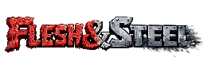

Progetto a gruppi del 3° anno SAMT.
Flesh & Steel è un videogioco top-down 2D con meccaniche roguelike, sviluppato utilizzando Godot Engine 4 e C#.

## Descrizione del Gioco

Il titolo si basa su un sistema di combattimento a due stati intercambiabili:
* Flesh: modalità a distanza per l'utilizzo di proiettili.
* Steel: modalità da mischia focalizzata su scatti e danni a corto raggio.

Il giocatore deve esplorare una mappa a stanze, sconfiggere diverse tipologie di nemici (corpo a corpo e distanza) e affrontare il boss finale, The Warden, caratterizzato da tre fasi di combattimento distinte.

## Tecnologie Utilizzate

* Engine: Godot Engine 4.x
* Linguaggio di programmazione: C# (.NET)
* Design: Pixel art 2D con Aseprite

## Struttura della Repository

La cartella principale è suddivisa per riflettere le fasi del progetto scolastico:
* 1_QdC: specifiche e requisiti.
* 3_Documentazione: documentazione tecnica e resoconti degli sprint.
* 4_Diario: diari di lavoro.
* 5_Applicativo: codice sorgente del progetto Godot e asset grafici.
* 7_Allegati: materiale supplementare.

## Sviluppatori

* Armir Cetaj
* Samuele Zambetti
* Nicolas Righenzi
* Michel Massard
